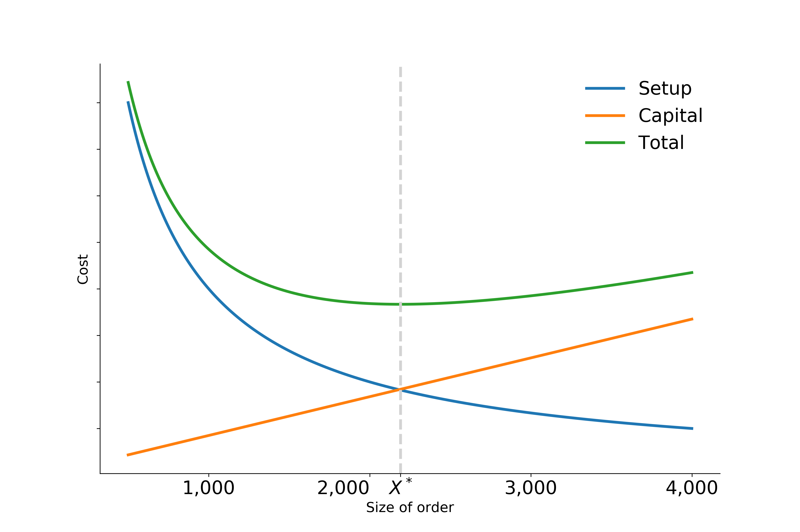

EOQ model
=========

The **EOQ** inventory management model provides a stylized representation of the decision problem faced by a firm that needs to determine the order quantity of a product that minimizes the unit cost per piece.  The unit cost :math:`T` depends on the price of the product :math:`C`, the size of the order :math:`X` as each comes with a fixed cost :math:`S`, and an annual capital cost :math:`R` expressed as a percentage of the value of the inventory. Core simplifications of the model include a constant monthly demand :math:`M` over the year and the delivery of each order in full when inventory reaches zero.

We can then derive the unit cost as follows:

.. math::
  T = \underbrace{\frac{1}{12\times M}\times R\times  \frac{C\times X + S}{2}}_{\text{Part I}} + \underbrace{\frac{S}{X} + C}_{\text{Part II}}.

The first part of the equation denotes the capital cost of one unit in storage. It is computed based on the ratio of the value of the average stock and the total number of ordered units during the year. The second part captures each unit's cost as part of an order of size :math:`X`.

The economic order quantity :math:`X^*` is determined as:

.. math::
  X^* = \sqrt{\frac{24\times M\times S}{R\times C}}.

The figure below reproduces the fundamental economic trade-offs of the model for a fixed parameterization of :math:`M`, :math:`C`, :math:`S`, and :math:`R`. An increase in the size of order :math:`X` results in a decrease in the setup cost per unit, but at the same time, capital cost increases as the stock of inventory increase.

Going forward, we treat the annual interest and depreciation rate :math:`R` as an exogenous parameter and set it to 10%. We can map the example to our more general notation by denoting the optimal order quantity as :math:`y` and collecting the three remaining input parameters in :math:`\mathbf{x}` as follows:

.. math::
  \begin{aligned}
  \mathbf{x}=(x_1,x_2,x_3)^T = (M, C, S)^T.
  \end{aligned}
