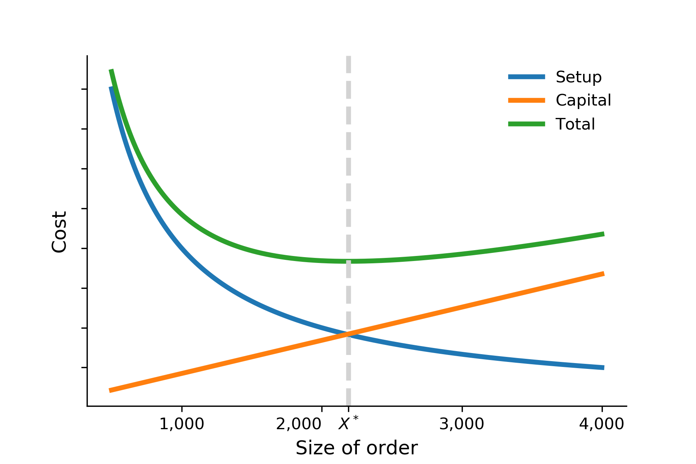

Example
=======

We follow :cite:`Borgonovo.2016` and use the **Economic Order Quantity (EOQ)** model as a running example throughout this documentation. The model was developed by Ford W. Harris (:cite:`Harris.1990`) to solve the problem of firms determining the ideal order size for one year, considering costs of holding an inventory, and costs of placing an order.

There are four main variables. :math:`M` is the number of units of good needed per month, :math:`C` denotes the unit price of the good, :math:`X` is the size of order in number of units, and :math:`S` is the cost of placing an order, also known as the setup cost. We treat the annual interest and depreciation rate :math:`R` as an exogenous parameter and set to 10%.

We can derive the total cost per unit :math:`T` as follows:

.. math::
  T = \underbrace{\frac{1}{12\times M}\times R\times\frac{CX + S}{2}}_{\text{Part I}} + \underbrace{\frac{S}{X} + C}_{\text{Part II}}

The first part of the equation is the average cost of interest and depreciation for one unit of good for one year. The second part captures the average cost of placing an order of :math:`X` units of goods. We can easily determine the economic order quantity :math:`X^*` that minimizes total costs.

.. math::
  X^* = \sqrt{\frac{24\times M\times S}{R\times C}}

The figure below reproduces the basic economic trade-offs of the model. It shows that keeping :math:`M`, :math:`C` and :math:`S` constant, an increase in the size of order :math:`X` results in a decrease in set-up costs, but an increase in interest and depreciation cost.

Going forward, we use a more general notation and use :math:`y` for the optimal order quantity for a given parameterization of the model and collect all three input parameters in :math:`\mathbf{x}=(x_1,x_2,x_3)^T`.
