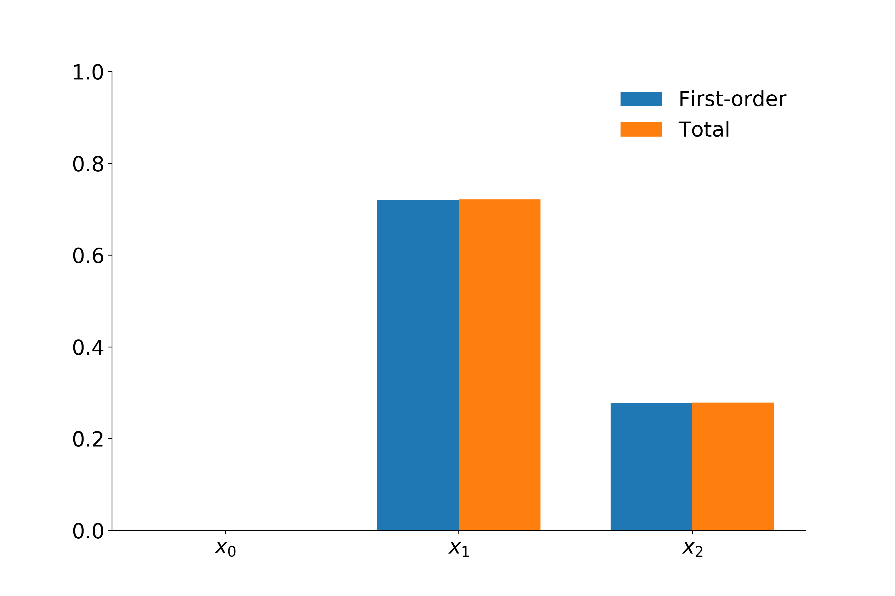

Quantitative sensitivity analysis
=================================

When analyzing (complex) computational models it is often unclear from the model specification alone how the inputs of the model contribute to the outputs. As we've seen in the previous tutorial on *Qualitative sensitivity analysis*, a first step is to sort the inputs by their respective order of importance on the outputs. In many cases however, we would like to learn by how much the individual inputs contribute to the output in relation to the other inputs. This can be done using Sobol indices (:cite:`Sobol.1993`). Classical Sobol indices are designed to work on models with independent input variables. However, since in economics this independence assumption would be very questionable, we focus on so called generalized Sobol indices, as those proposed by :cite:`Kucherenko.2012`, that also work in the case of dependent inputs.

Generalized Sobol indices
^^^^^^^^^^^^^^^^^^^^^^^^^

Say we have a model :math:`\mathcal{M}:\mathbb{R}^n \to \mathbb{R}, x \mapsto \mathcal{M}(x)` and we are interested in analyzing the variance of its output on a given subset :math:`U \subset \mathbb{R}^n`, i.e. we want to analyze

.. math::

  D := \text{Var}(\mathcal{M}|_U) := \int_U (\mathcal{M}(x) - \mu_U)^2 f_X(x) \mathrm{d}x

where :math:`\mu_U := \int_U \mathcal{M}(x) f_X(x) \mathrm{d}x` denotes the restricted mean of the model and :math:`f_X` denotes the probability density function imposed on the input parameters. For the sake of brevity let us assume that :math:`\mathcal{M}` is already restricted so that we can drop the dependence on :math:`S`. To analyze the effect of a single variable, or more general a subset of variable, consider partitioning the model inputs as :math:`(y, z) = x`. The construction of Sobol and generalized Sobol indices starts with noticing that we can decompose the overall variance as

.. math::

  D = \text{Var}_y(\mathbb{E}_z\left[\mathcal{M}(y, z) \mid y \right]) + \mathbb{E}_y\left[\text{Var}_z(\mathcal{M}(y, z) \mid y)\right]

which implies that

.. math::

  1 = \frac{\text{Var}_y(\mathbb{E}_z\left[\mathcal{M}(y, z) \mid y \right])}{D} + \frac{\mathbb{E}_y\left[\text{Var}_z(\mathcal{M}(y, z) \mid y)\right]}{D} =: S_y +     S_z^T

We call :math:`S_y` the *first order effect index* of the subset :math:`y` and we call :math:`S_z^T` the *total effect* of the subset :math:`z`. Notice that for each partition of the input space :math:`y` and :math:`z`, the above provides a way of computing the fraction of explained variance. For the sake of clarity, assume :math:`y` represent only a single input variable. Then :math:`S_y` can be interpreted as the effect of :math:`y` on the variability of :math:`\mathcal{M}` **without** considering any interaction effects with other variables. While :math:`S_y^T` can be thought of as representing the effect of :math:`y` on the variance via itself **and** all other input variables.

Again, we now apply this to the **EOQ** model. Given the current limits to our implementation and the fact that the parameters of the model need to remain positive, we specify that the parameters follow a normal distribution with a very small variance.

Shapely values
^^^^^^^^^^^^^^

In this overview, we give brief notational insights on variance-based sensitivity analysis as well as the Shapley value's theoratical framework (:cite:`Song.2016`). We follow the framework on variance-based sensitivity analysis and Shapley values developed by :cite:`Song.2016`.

Variance-based Sensitivity Analysis (SA) can be illustrated in the following manner. Consider a model with :math:`k` inputs denoted by :math:`X_K = \{X_1, X_2, X_3, \dots, X_k \}` where :math:`K = \{1, 2, \dots, k\}`. Consider also :math:`X_J`, which indicates the vector of inputs included in the index set :math:`J \subseteq X`. The uncertainty in :math:`X_K` is represented by the joint cumulative distribution :math:`G_K`. Furthermore, we denote the joint distribution of inputs included in the index set :math:`J` as :math:`G_J` and the marginal distribution of each :math:`X_i` as :math:`G_i`. The model is treated as a blackbox, and only the model response is analysed. The model response :math:`Y` is a function of the inputs, i.e., :math:`Y = f(X_K)` and therefore :math:`f(X_K)` is stochastic due to the uncertainty in :math:`X_K` although :math:`f(\cdot)` is deterministic. Often, :math:`f(\cdot)` has a complex structure, and does not have a closed form expression. The overall uncertainty in the model output :math:`Y` caused by :math:`X_K` is :math:`Var[Y]`, where the variance is calculated with respect to the joint distribution :math:`G_K`. The Shapley value then, helps us to quantify how much of :math:`Var[Y]` can be attributed to each each :math:`X_i`.

An analogous framework to the one developed for variance-based sensitivity analysis above is apparent in the specification of the Shapley value. Formally, a *k-player game* with the set of players :math:`K = \{1,2, \dots, k\}` is defined as a real valued function that maps a subset of :math:`K` to its corresponding cost (or value), i.e., :math:`c: 2^K \rightarrow  {\rm I\!R}` with :math:`c(\emptyset) = 0`. With this in mind, :math:`c(J)` then, represents the cost that arises when the players in the subset :math:`J` of :math:`K` participate in the game. The Shapley value for player :math:`i` with respect to :math:`c(\cdot)` is defined as

.. math::

  v_i = \sum_{J \subseteq K \backslash \{i\}}^{} \frac{(k -|J| - 1)! |J|!}{k!} \cdot (c(J \cup \{i\}) -c(J)),

where :math:`|J|` indicates the size of :math:`J`. In other words, :math:`v_i` is the incremental cost of including player :math:`i` in set :math:`J` averaged over all sets :math:`J \subseteq K \backslash \{i\}`.  The Shapley value gives equal weight to each :math:`k` subset sizes and equal weights amongst the subsets of the same size, which is important in determining the fairness of the variance allocation in the calculation of Shapley effects in variance-based sensitivity analysis (:cite:`Song.2016`).  Reconciling the two frameworks by direct comparison, we can think of the set of :math:`K` players as the set of inputs of :math:`f(\cdot)` and define :math:`c(\cdot)` so that for :math:`J \subseteq K`, :math:`c(J)` measures the variance of :math:`c(J)` caused by the uncertainty of the inputs in :math:`J`.

The ideal :math:`c(\cdot)` should satisfy the conditions: :math:`c(\emptyset) = 0` and :math:`c(K) = Var[Y]`. Two such candidates for such :math:`c(\cdot)` can be considered, and have been shown to be equivalent are equivalent (:cite:`Song.2016`).
The first cost function is 

.. math::

  \tilde{c}(J) = Var[E[Y|X_J]].

This cost function satisfies the two conditions from above and was originally put forth by :cite:`Owen.2014` and later adopted by :cite:`Song.2016` in their paper. The cost function can be rewritten as :math:`\tilde{c}(J) = Var[Y] - E[Var[Y|X_J]]`, and interpreted as the expected reduction in the output variance when the values of :math:`X_J` are known. The second cost function that satisfies the required conditions is

.. math::

  c(J) = E[Var[Y|X_{-J}]]

where :math:`X_{-J} = X_{K \backslash J}`. :math:`c(J)` is interpreted as the expected remaining variance in :math:`Y` when the values of :math:`X_{-J}` are known. In this case, the incremental cost :math:`c(J \cup \{i\}) -c(J)` can be interpreted as the expected decrease in the variance of :math:`Y` conditional on the known input values of :math:`X_i` out of all the unknown inputs in :math:`J \cup \{i\}`. 

Although both cost functions result in the same Shapley values, their resultant estimators from Monte Carlo simulation are different. :cite:`Sun.2011` reveal that the Monte Carlo estimator that results from the simulation of :math:`\tilde{c}(J)` can be severely biased if the inner level sample size used to estimate the conditional expectation is not large enough. Given the already computationally demanding structure of microeconomic models, this added computational complexity is costly. In contrast however, the estimator of :math:`c(J)` is unbiased for all sample sizes. Because of this added feature, we follow :cite:`Song.2016` in using the cost function :math:`c(J)` rather that :math:`\tilde{c}(J)`. We therefore define the *Shapley effect* of the :math:`i_{th}` input, :math:`Sh_i`, as the Shapley value obtained by applying the cost function :math:`c(J)` to the Shapley value equation. Indeed, any Shapley value defined by the satisfaction of the two conditions: :math:`c(\emptyset) = 0` and :math:`c(K) = Var[Y]` imply that

.. math::

  \sum_{k}^{i=1} Sh_i = Var[Y],

even if there is dependence or structural interactions amongst the elements in :math:`X_K`. Throughout the package, we use :math:`Sh_i` to denote the Shapley effect and :math:`v_i` to denote the generic Shapley value.
