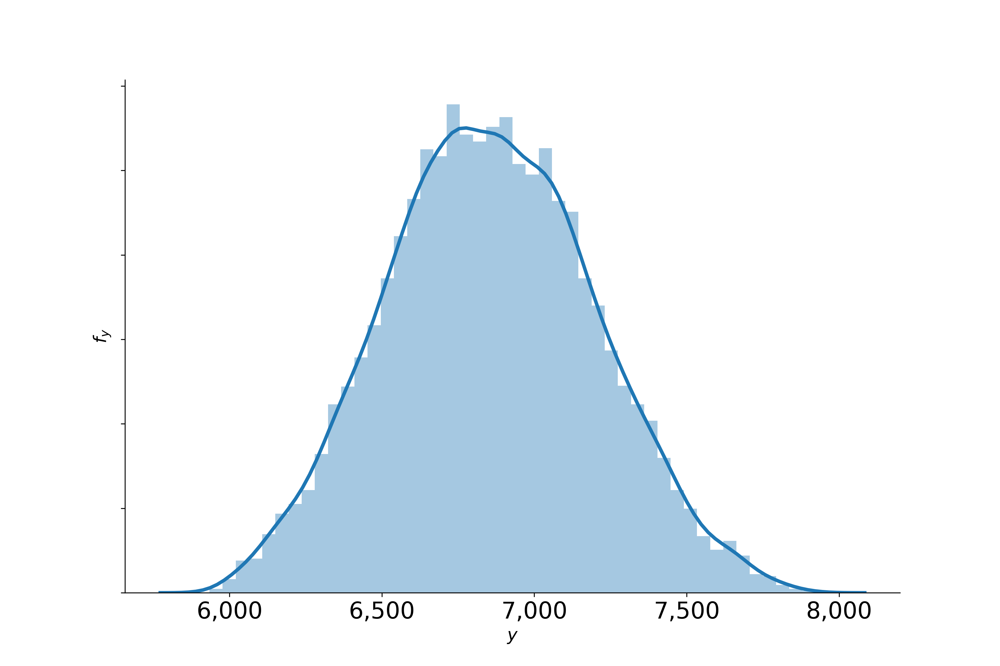

Uncertainty propagation
=======================

We start from a probabilistic model for the input parameters that is informed by, for example, expert knowledge or the outcome of a calibration. We treat the model parameters :math:`\mathbf{X}` as a simple random vector with a joint probability density function :math:`f_{\mathbf{X}}`. We are not particularly interested in the uncertainty of each individual parameter of the model. Instead we seek to learn about the induced distribution of the model output :math:`Y` as the uncertainty about the model parameters :math:`\mathbf{X}` propagates through the computational model :math:`\mathbf{M}`. We want to study the statistical properties of :math:`Y`.

We now return to the example of the **EOQ** model. We specify a uniform distribution centered around :math:`\mathbf{x^0}=(M, C, S) = (1230, 0.0135, 2.15)` and spread the support 10% above and below the center. We solve for the optimal economic order quantity :math:`Y` for :math:`1,000` random input parameters and end up with the distribution :math:`f_{Y}` below.

