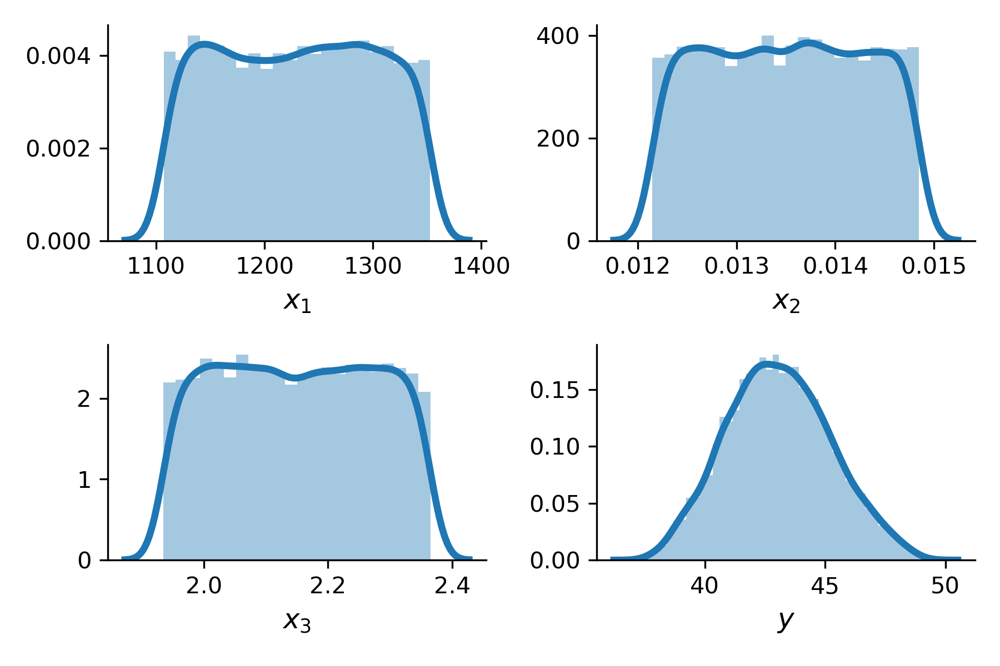
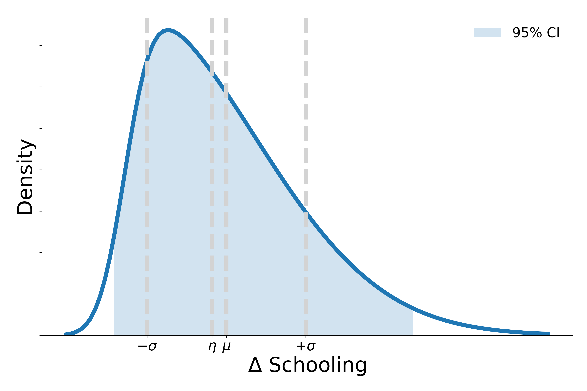
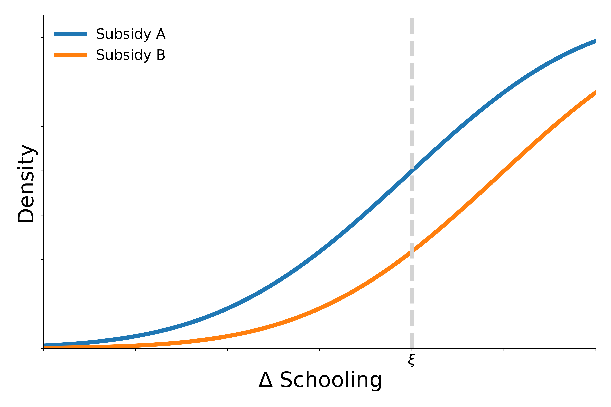
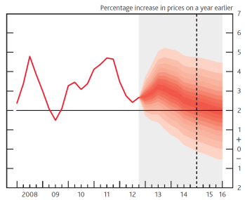

.. role:: raw-math(raw)
    :format: latex html

Uncertainty Propagation
=======================

The estimation step provides us with a probabilistic model for the input parameters. Going forward, we treat the model parameters :math:`\boldsymbol{X}` as a simple random vector following a normal distribution with mean :math:`\mu`, covariance matrix :math:`\Sigma`, and joint probability density function :math:`f_{\boldsymbol{X}}`. We are not particularly interested in the uncertainty of each individual parameter of the model. Instead we seek to learn about the induced distribution of the model output :math:`Y` as the uncertainty about the model parameters :math:`\boldsymbol{X}` propagates through the computational model :math:`\boldsymbol{M}`. We want to study the statistical properties of :math:`y`.

Example
-------

.. todo::

  @loikein

  - [ ] add here a description and figure (no code) for uncertainty propagation figure 2 in Borgonovo & al reference. 
  - [x] add the code for that to docs/_static/codes and add its execution to our GitHub Action

   An expansion of Figure 2 of :cite:`Borgonovo.2016`

Prediction
----------

We want to have an image such as the one below following some simple model. The codes for these graphs are available in _static/codes.

Forecasting
-----------

We want to have an image such as below produced from some simple model.

